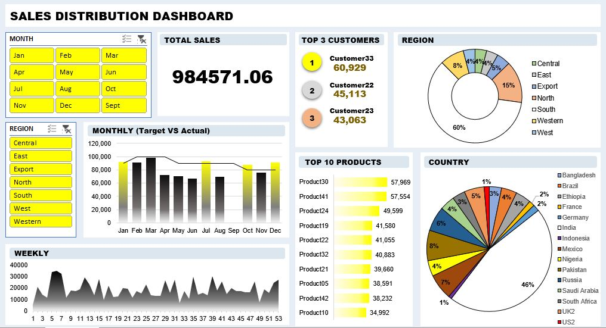

# 🌍 Sales Distribution Dashboard

---

## 📚 About Data
This dashboard analyzes total sales of 984,571.06, featuring monthly target vs actual comparisons, weekly trends, and regional performance. It highlights the top 3 customers, top 10 products, and shows sales distribution across 7 regions and 16 countries, with the UK leading at 46%.

## 💡 Highlights

- Total Sales: Achieved 984,571.06 in total sales across all months and regions.
- Top Country: The UK leads with 46% of total sales, followed by strong contributions from Russia and Saudi Arabia.
- Top Customers: Customer33, Customer22, and Customer23 are the top buyers, together contributing over 149,000 in sales.
- Top Products: Product30 and Product41 are the best-selling items, each generating over 57,000 in revenue.
- Performance Trends: The monthly actual vs target chart and weekly sales graph help track sales consistency and identify performance gaps.

## ✏️ Data Wrangling
- Removed rows with missing values.
- Cleaned and converted valuation and funding columns to numeric format.
- Excluded rows with “Unknown” funding values.
- Expanded the Select Investors column into separate rows for detailed categorical analysis.

📍 Clean Data: Sales-Distribution-Dashboard.csv

## 📊 Visualization
- Produced a 1-pager dashboard using Excel.
- Excel dashboard : [Link](https://drive.google.com/uc?export=download&id=1gEr4nURQSIpoMSEEYyjrqmv_4Q6RnMyF)

